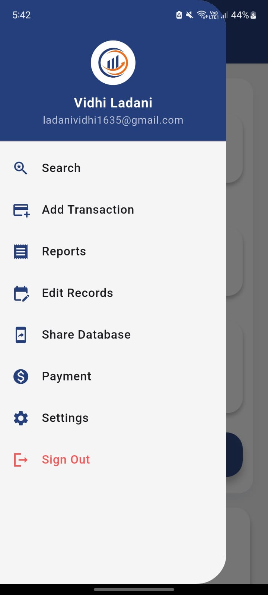
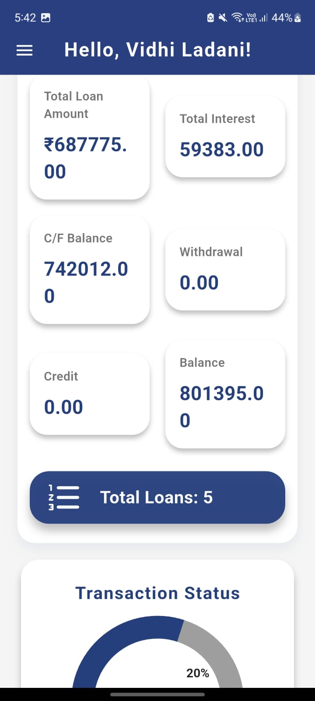
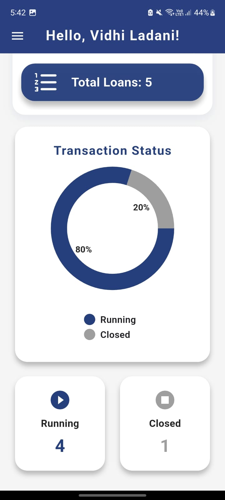
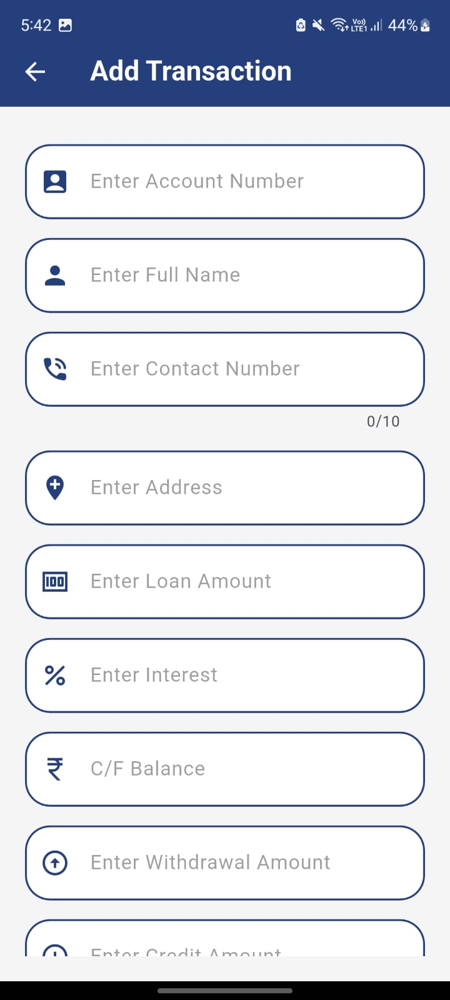
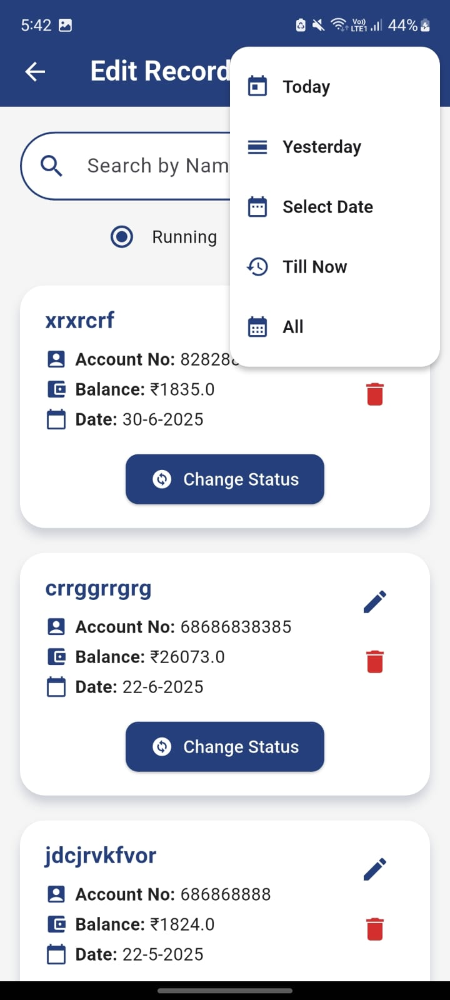
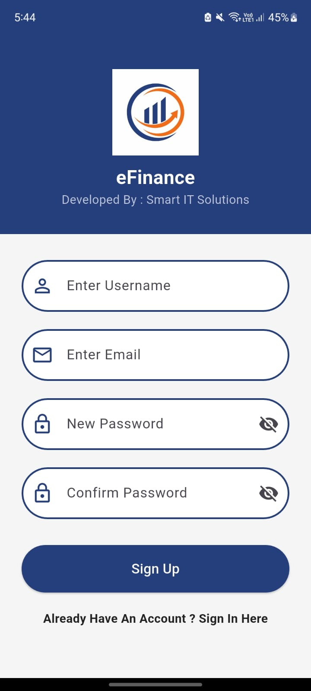
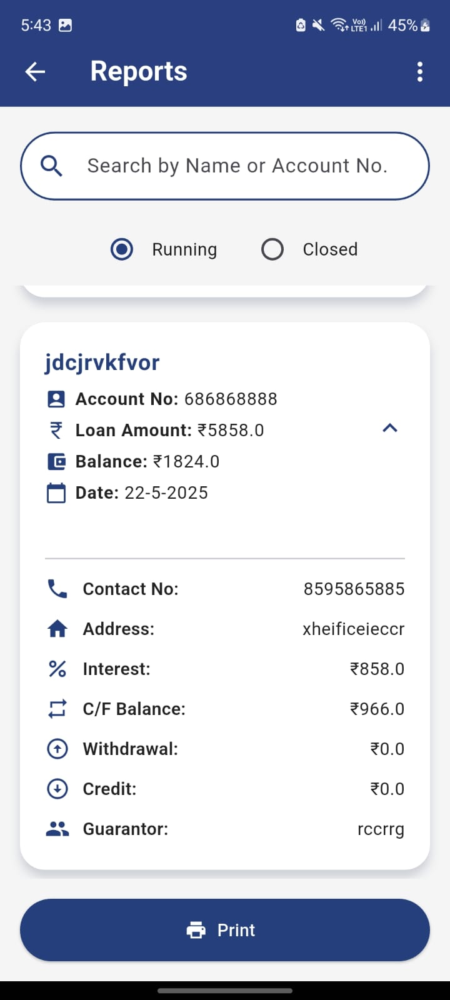
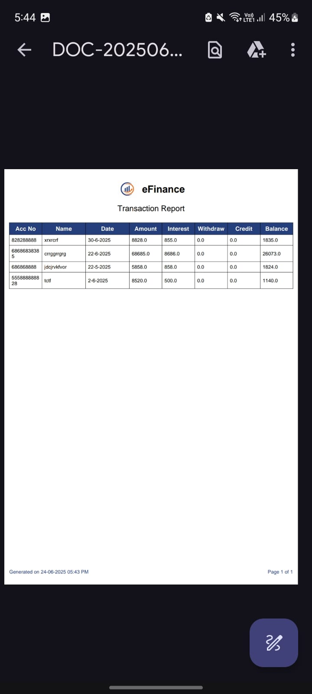

# 📊 eFinance — Personal Loan Management App

A modern, offline-first finance management Flutter app to handle personal loans, transactions, interest, and balance records efficiently.  
Built for individuals and small businesses to track running and closed loan accounts with intuitive UI and useful analytics.

---

## ✨ Features

- 📋 Add new transactions with loan, interest, and balance details
- 📝 Edit and delete existing records
- 📊 Dashboard with total loan stats and pie chart visualization
- 🔍 Search transactions by account number, name, or date
- 📈 Carry forward balances at the start of each month (once per month)
- 📂 Share complete offline database file directly via your device
- 🔐 User login with email and password
- 🎨 Clean, modern, mobile-friendly UI

---

## 📱 App Screens Overview

| 📱 Screen                    | 📝 Description |
|:----------------------------|:-----------------------------------------|
| **Dashboard**                | Displays a summary of total loan stats, transaction status pie chart, and navigation drawer to access all major features. |
| **Dashboard Stats Cards**    | Shows cards with Total Loan, Total Interest, C/F Balance, Total Withdrawal, Total Credit, and Current Balance. |
| **Add Transaction**          | A form to enter a new transaction record including loan details, personal info, guarantor, and amounts. |
| **Edit Records**             | Lists all transactions with options to edit, delete, or change status. |
| **Transaction Record Card**  | Displays transaction details like Account No, Balance, Date, and Status change option in card format. |
| **Change Status Dialog**     | An alert dialog for confirming transaction status changes from Running to Closed or vice versa. |
| **Search Transaction**       | Lets you search transactions by account number, name, or date using filtering options. |

---

## 🔄 Carry Forward System

- ✅ One-click **Carry Forward Balance** button in Dashboard
- ✅ Runs monthly SQL queries to update balances as per business logic
- ✅ Protected using **SharedPreferences** to track month-wise operation
- ✅ Alerts user if already carried forward this month

---

## 📂 Database Sharing Feature

- ✅ One-click **Share Database** option in the Drawer
- ✅ Exports the local `efinance.db` SQLite database file via device share intent
- ✅ Transfers complete offline transaction and user data

---

## 📸 App Screenshots

  
  
  
  
  
  
  
  

---

## 🛠️ Tech Stack

- 📱 Flutter (Dart)
- 🗄️ Sqflite (Local SQLite Database)
- 📦 SharedPreferences
- 📤 Share Plus
- 📊 Pie Chart (flutter_chart)

---

## 🚀 Getting Started

1. Clone the repository
2. Run `flutter pub get`
3. Launch using your preferred emulator or real device
4. Enjoy managing finances offline 📊

---

## 🙏 Special Thanks

A huge thank you to **Dhyey Shah** for his valuable inputs, brainstorming, and collaboration throughout the development of **eFinance**.  
Your contributions made this app sharper, smarter, and a lot more intuitive. 🚀👏

---

## 🤝 Collaborators

| Name        | Role              |
|:------------|:-----------------|
| **Vidhi**      | Developer & Designer |
| **Dhyey Shah** | Contributor & Product Ideas |

---

## 📬 Connect

- 📧 Vidhi Ladani — ladanividhi1635@gmail.com
- 📧 Dhyey Shah — dhyeyshah009@example.com

---

**Thank you for checking out eFinance! 💙**

